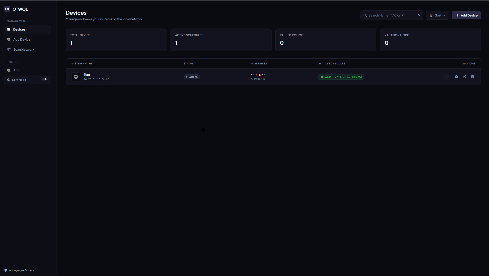
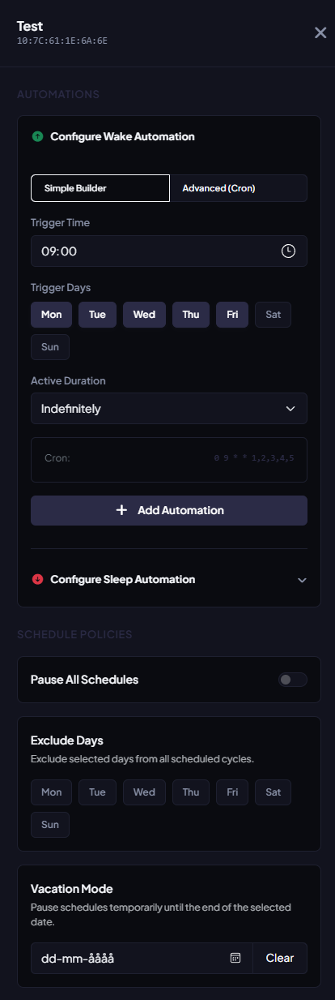

# OTWOL — Open Wake-on-LAN Portal

OTWOL is a modern, lightweight, self-hosted web dashboard and management portal for network hosts. It provides real-time status monitoring and wakes computers up using Wake-on-LAN (WOL). Built using **Flask**, **SQLAlchemy (SQLite)**, and **Docker**, it is designed to be easily deployed in home labs or enterprise networks.

---

## 📸 Showcase

### Interactive Dashboard
The main dashboard displays all registered network hosts, their current online/offline status, IP/MAC addresses, and action buttons to wake, ping, or edit.



### Host Configuration
Configure individual hosts, probe settings (ICMP Ping, ARP, or TCP), and schedule automation with flexible overrides.



---

## ✨ Features

- **📊 Live Host Monitoring**: Track machine status in real-time with background Ajax auto-refreshing. Probing supports:
  - **ICMP Ping**: Standard network echo request.
  - **ARP Queries**: Subnet-level MAC address verification.
  - **TCP Ports**: Port connectivity validation.
- **⚡ Advanced Wake-on-LAN Operations**:
  - **L4 UDP Broadcast**: Standard magic packet transmission.
  - **L2 Raw Socket Transmission**: Direct Layer-2 raw Ethernet frame generation to custom interfaces (ideal for cross-subnet or complex VLAN topologies).
- **📅 Smart Automation & Scheduling**:
  - Schedule wake/sleep actions via integrated cron job templates.
  - **Vacation Overrides**: Temporarily disable automation until a specified date.
  - **Exclusion Days**: Easily exclude certain days of the week (e.g., weekends).
  - **Schedule Pausing**: Pause schedules globally or per-host with a single click.
- **🔒 Flexible Authentication**:
  - **Local Authentication**: Form-based user logins.
  - **Single Sign-On (SSO)**: Federated authentication using OpenID Connect (OIDC) (e.g., Keycloak, Auth0, Okta).
- **🐳 Dockerized Setup**: Fast multi-architecture container deployment with environment variable configuration.
- **💾 SQLite Backend**: Automatically migrates configuration from flat files (`computers.txt`) into a robust SQLite database.

---

## 🚀 Quick Start

Deploy the portal quickly using Docker Compose:

1. Create a `docker-compose.yml` file:
   ```yaml
   services:
     otwol:
       image: oerum/otwol:latest # Or build locally using the Dockerfile
       container_name: otwol-portal
       ports:
         - "5000:5000"
       restart: unless-stopped
       volumes:
         - ./appdata/db:/app/db
         - ./appdata/cron:/etc/cron.d
       environment:
         TZ: "Europe/Paris"
         APP_LOCAL_AUTH: "true"
         APP_USER: "admin"
         APP_PASS: "admin"
   ```

2. Start the container:
   ```bash
   docker compose up -d
   ```

3. Open your browser and navigate to `http://localhost:5000`.

---

## ⚙️ Configuration Variables

The following environment variables can be configured inside `docker-compose.yml`:

| Variable | Default | Description |
|---|---|---|
| `TZ` | `UTC` | Timezone for scheduled tasks (e.g., `Europe/Paris`). |
| `PORT` | `5000` | Host port mapping for the container. |
| `BIND_ADDRESS` | `0.0.0.0` | Network interface binding. |
| `DATABASE_FILE` | `/app/db/computers.db` | Path to the internal SQLite database. |
| `APP_LOCAL_AUTH` | `false` | Enable/disable username/password login. |
| `APP_USER` | `admin` | Local admin username. |
| `APP_PASS` | `admin` | Local admin password. |
| `APP_OIDC_AUTH` | `false` | Enable/disable OIDC Single Sign-On. |
| `OIDC_ISSUER_URL` | - | OIDC IdP Issuer endpoint URL. |
| `OIDC_CLIENT_ID` | - | Client ID registered with IdP. |
| `OIDC_CLIENT_SECRET`| - | Client Secret registered with IdP. |
| `OIDC_REDIRECT_URL` | - | Canonical external URL of this deployment. |
| `WOL_L2_MODE` | `false` | Force Layer-2 raw frame transmission instead of UDP. |
| `WOL_L2_INTERFACE` | `eth0` | Network interface for L2 packets. |
| `SCAN_PING_TIMEOUT_MS`| `300` | Timeout for ICMP status checks. |
| `SCAN_ARP_TIMEOUT_MS` | `300` | Timeout for ARP query status checks. |

---

## 📄 License

This project is licensed under the Apache License 2.0. See the [LICENSE](LICENSE) file for details.
